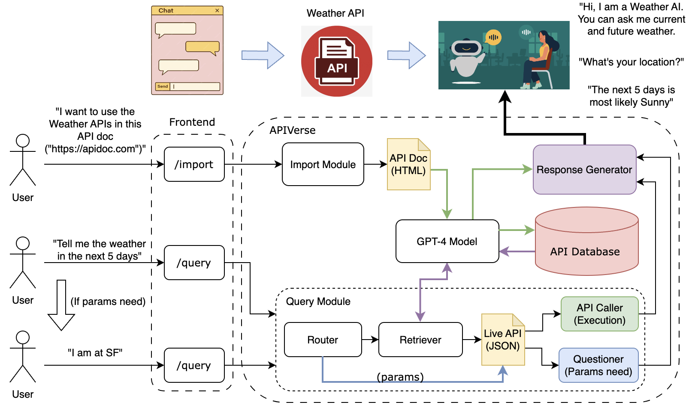

# APIVerse (Cal Hacks 10.0)

    

🪐 APIVerse's goal is to provide a more convenient approach to utilizing APIs. We are in the process of developing an API platform that enables users to import API documentation from various sources and offers a natural conversational interface for interacting with the APIs.

**💡: Make it simply to interact with technoloy!**

# Project Design
✨ Here is the high level design of the project architecture. (**React** + **Flask**)

# Contribution
**Author:**
- Jingchao (Perry) Zhong
- Jiaxiang (Calvin) Li
- Junyi (Alex) Zhang
- Yufeng (Jimmy) Li